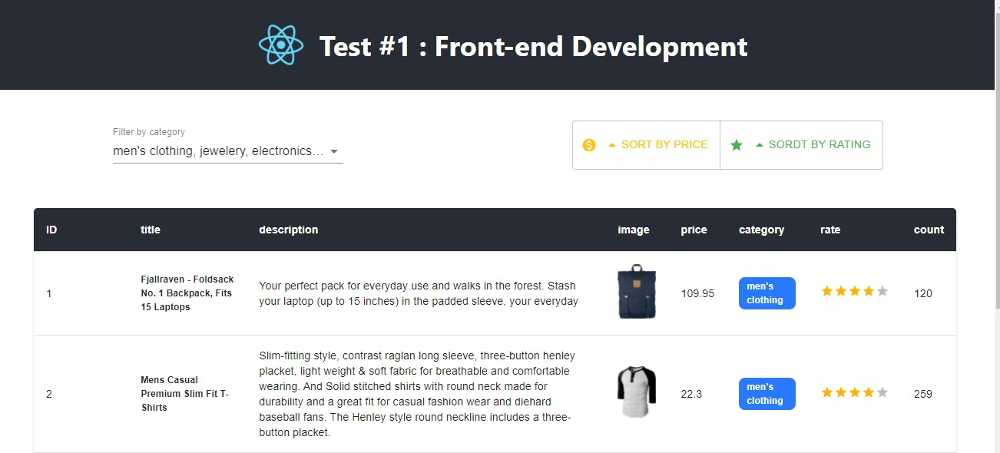

# STEP 1

create a react application using the command `npx create-react-app matious`

# STEP 2

clean the project  && create components folder `src/components`

# STEP 3

create the first component `src/components/CutomTable`
using MATERIAL-UI components.

# STEP 4

trying to fetching data from the [fakestoreapi](https://fakestoreapi.com/products)

# STEP 5

create filter and sort buttons with their functions.
and finnaly customise style

### `npm run build`

Builds the app for production to the `build` folder.\

### `npm start`

start the application.

